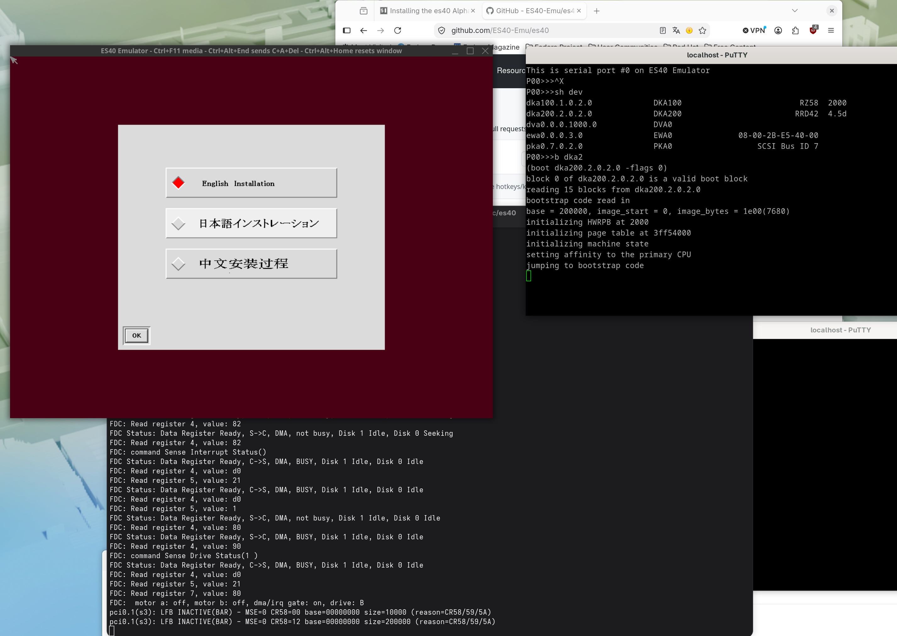
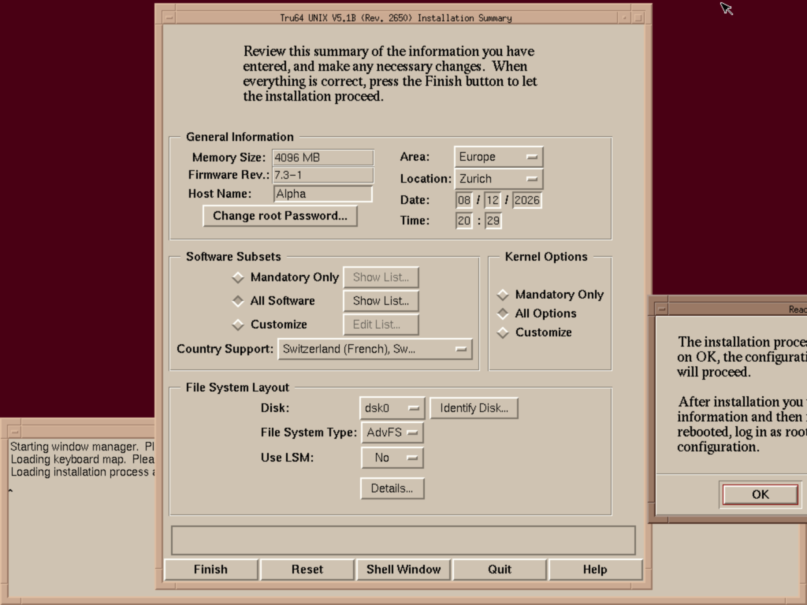

# Installing Tru64 on the ES40 Emulator on Linux

## Preliminaries

Download 6 CD images (5.1B) and the 5.1B4 patch kit.

I downloaded all disks from:

- <https://winworldpc.com/product/tru64/51b>

or

- <https://fsck.technology/software/DEC-Compaq/Tru64%20Install%20Media/Tru64%20UNIX%205.1B4/>

and Patchkit 5.1B8:

- <https://www.zx.net.nz/vc/updates/opsys/dunix.shtml>
- direct link: <https://ftp.zx.net.nz/pub/Patches/digital/additional/tru64/5.1B-6/T64V51BB29AS0008-20100821.tar>

Then get ES40: <https://github.com/ES40-Emu/es40/>

and the VGA ROM emulator file from:

- <https://github.com/BaRRaKudaRain/PCem-ROMs/blob/master/86c764x1.bin>

and `cl67srmrom.exe` from:

- <https://raymii.org/s/inc/downloads/es40-srmon/cl67srmrom.exe>
  (via [this raymii.org writeup](https://raymii.org/s/blog/Installing_the_es40_AlphaServer_emulator_0.18_on_Ubuntu_16.04_and_trying_to_install_openVMS_8.4_on_es40.html))

## Install ES40

```bash
git clone --recurse-submodules https://github.com/ES40-Emu/es40.git es40-git
cd es40-git
./autogen.sh
./configure --enable-asmjit
make -j6
mkdir rom
cp ~/Downloads/86c764x1.bin rom
cp ~/Downloads/cl67srmrom.exe rom
```

To install into `/usr/bin`:

```bash
make install
```

Then adapt directories relative to your local install.

## Prepare ES40 (emulator configuration) and install Tru64

```bash
mkdir disks
```

> Note: an earlier draft of this guide also had a `mkdir isos` step, but the ISO
> ends up in `disks/cd_to_mount.iso` below, so `isos` isn't actually used.

Then run:

```bash
src/es40_cfg
```

### Display

```
Do you want to have a GUI? (none,SDL) [none]: SDL
Do you want to set a custom scale ratio for the display output? (no,yes) [no]: no
Should the display output be nearest or bilinear? (nearest,bilinear) [bilinear]: bilinear
Enable runtime display scale changes via hotkeys? (no,yes) [no]: yes
Would you like to customize the SDL GUI keyboard shortcuts? (no,yes) [no]: no
```

Useful SDL GUI runtime hotkey defaults:

| Action                              | Hotkey            |
|--------------------------------------|-------------------|
| Mouse capture                        | Ctrl+F10          |
| Removable media selector             | Ctrl+F11          |
| Send Ctrl+Alt+Delete to the guest    | Ctrl+Alt+End      |
| Reset window size                    | Ctrl+Alt+Home     |
| Increase runtime window scale        | Ctrl+PageUp       |
| Decrease runtime window scale        | Ctrl+PageDown     |

### CPU and memory

```
RAM:              4GB
SRM ROM:          rom/cl67srmrom.exe
Flash ROM:        rom/flash.rom
DPR EEPROM:       rom/dpr.rom
CPUs:             4
CPU speed [MHz]:  500
```

### Serial ports

Defaults are OK.

### Disks, VGA, NIC

```
Do you want to add any disks to the Floppy controller? (none,0,1) [none]:
Do you want to add any disks to the built-in IDE controller? (none,0.0,0.1,1.0,1.1) [none]: none

What (if any) VGA card do you wish to add to the system? (none,S3) [S3]: S3
What PCI slot should the s3 card be on? (0.1,0.2,0.3,0.4) [0.1]: 0.1
Where can the VGA BIOS ROM image be found? [rom/CHANGE_ME_TO_CORRECT_VGA_BIOS_FOR_SELECTED_CARD_NOT_VGABIOS-0.6a.bin]: rom/86c764x1.bin

Would you like to add another PCI card to the system? (none,nic,scsi,lsi scsi,es1370 audio) [none]: scsi
In what PCI slot would you like to put the sym53c810 card? (0.2,0.3,0.4,1.1,1.2,1.3,1.4,1.5,1.6) [0.2]: 0.2

Do you want to add any disks to the Sym53C810 controller? (none,0,1,2,3,4,5,6) [none]: 1
How should disk0.1 be emulated? (file,device,ramdisk) [file]: file
What file should disk0.1 use?: disks/bootimgtru64.img
Should disk0.1 be a disk or a cd-rom device? (disk,cd-rom) [disk]: disk
If the file doesn't exist, do you want us to create it? (no,yes) [yes]: yes
What unit do you want to use to specify the disk size? (KB,MB,GB) [MB]: GB
How many GBytes should the disk be? (1-1024) [10]: 20
Should disk0.1 be a read-only disk? (no,yes) [no]: no
Would you like to set a disk model number?:
Would you like to set a revision number?:
Would you like to set a serial number?:

Do you want to add any disks to the Sym53C810 controller? (none,0,2,3,4,5,6) [none]: 2
How should disk0.2 be emulated? (file,device,ramdisk) [file]: file
What file should disk0.2 use?: disks/cd_to_mount.iso
Should disk0.2 be a disk or a cd-rom device? (disk,cd-rom) [disk]: cd-rom
Would you like to set a disk model number?:
Would you like to set a revision number?:
Would you like to set a serial number?:

Do you want to add any disks to the Sym53C810 controller? (none,0,3,4,5,6) [none]: none

Would you like to add another PCI card to the system? (none,nic,scsi,lsi scsi,es1370 audio) [none]: nic
In what PCI slot would you like to put the dec21143 card? (0.3,0.4,1.1,1.2,1.3,1.4,1.5,1.6) [0.3]: 0.3
How should this NIC connect to the host network? (pcap,tap) [pcap]: tap
What host network interface should we connect to (answer ? for a list)? (list,1,2,...): list
What should the NIC's MAC address be? [08-00-2B-E5-40-00]:

Would you like to add another PCI card to the system? (none,nic,scsi,lsi scsi,es1370 audio) [none]:
Where would you like console output to go? (serial,graphics) [graphics]:
Where would you like printer output to go?:
Enable the M7101 power-management / ACPI device at PCI 0:17? (yes,no) [yes]:
Enable the USB OHCI controller at PCI 0:19? (yes,no) [yes]:
Which OS the reported year should be compatible with? (nt,vms) [vms]:
Do you want to set a fixed date and time when the VM starts? (yes,no) [no]:
```

## First boot

```bash
mkdir disks
cp ~/Downloads/"Tru64 UNIX 5.1B - Disk 1 Operating System [DEC Alpha]/Tru64 UNIX 5.1B - Operating System.iso" disks/cd_to_mount.iso
sudo setcap cap_net_raw+ep src/es40
src/es40
```

Wait while the disk image is being prepared. You'll be asked which NIC to use — choose option 5 (`tap0`).

The system initializes the pre-boot environment. At the `P00>>>` prompt:

```
P00>>> sh dev
dka100.1.0.2.0  DKA100  RZ58     2000
dka200.2.0.2.0  DKA200  RRD42    4.5d
dva0.0.0.1000.0 DVA0
ewa0.0.0.3.0    EWA0    08-00-2B-E5-40-00
pka0.7.0.2.0    PKA0    SCSI Bus ID 7

P00>>> b dka2
```

After some time the installer starts up:



Go through the options: install everything, full kernel, and add any language packs you want.



Hit **Finish**, then **OK**, and the installer copies everything.

## General commands

```bash
mount -r -t cdfs /dev/disk/cdrom1c /mnt/cdrom
```

## Networking — Linux side

Network layout:

| Host        | Address           |
|-------------|-------------------|
| Linux host  | 192.168.100.1/24  |
| Tru64 guest | 192.168.100.2/24  |

- `tap0` is a virtual Ethernet interface created by the Linux kernel.
- The host side gets `192.168.100.1`.
- ES40 attaches to the other side of the TAP device.
- The `tun` kernel driver provides the TAP functionality.
- `firewalld` is only needed if traffic must pass beyond the local host or if Fedora blocks the communication.

```bash
sudo nmcli connection add type tun ifname tap0 mode tap con-name tap0
sudo nmcli connection modify tap0 ipv4.method manual ipv4.addresses 192.168.100.1/24
sudo nmcli connection modify tap0 connection.autoconnect yes
sudo nmcli connection up tap0

sudo firewall-cmd --permanent --zone=trusted --add-interface=tap0
sudo firewall-cmd --reload
```

Check:

```bash
ip addr show tap0
nmcli connection show tap0
```

## Networking — Tru64 side

In setup, choose static, IP `192.168.100.2`, netmask `255.255.255.0`, routing/system IP `192.168.100.1` (the Linux host).

```
DNS network domain:         local
Primary DNS server name:    dns.google
Primary DNS server IP:      8.8.8.8
Secondary DNS server name:  dns.cloudflare.com
Secondary DNS server IP:    1.1.1.1
NTP server name:            pool.ntp.org
```

## Networking — Linux side, NFS server

```bash
sudo dnf install nfs-utils
sudo systemctl enable --now nfs-server

mkdir -p ~/tru64-share
chmod 777 ~/tru64-share
```

Add to `/etc/exports`:

```
/home/baettig/tru64-share 192.168.100.0/24(rw,sync,no_subtree_check,no_root_squash)
```

```bash
sudo exportfs -ra
sudo exportfs -v   # verify

sudo firewall-cmd --permanent --add-service=nfs
sudo firewall-cmd --reload
```

(The `tap0` interface should already be trusted from the step above — no need to add it again.)

## Networking — Tru64 side, NFS client

```bash
mkdir /mnt/fedora
mount -t nfs -o vers=3,proto=tcp 192.168.100.1:/home/baettig/tru64-share /mnt/fedora
```

Add to `/etc/fstab`:

```
192.168.100.1:/home/baettig/tru64-share /mnt/fedora nfs rw,vers=3,proto=tcp 0 0
```

## License PAKs

Download disk 1 from <https://winworldpc.com/product/tru64> (the 5.0 media — this is where the license PAK tools come from).

```bash
7z e "Tru64 UNIX 5.0 - Disk 1 Operating System.7z"
chmod +x Tru64-License-Paks.sh
./Tru64-License-Paks.sh
lmf list
```

## Installing the newest patch

Download the patch kit and untar it into the NFS share:

- <https://ftp.zx.net.nz/pub/Patches/digital/additional/tru64/5.1B-6/T64V51BB29AS0008-20100821.tar>
  (from <https://www.zx.net.nz/vc/updates/opsys/dunix.shtml>, on the Linux side)

```bash
mkdir /patch
cp -r /mnt/fedora/patch/* /patch
```

Reboot into single-user mode (`b -fl s` from the ROM console), then:

```bash
cd /patch
/sbin/bcheckrc
/sbin/kloadsrv
/usr/sbin/lmf reset
./dupatch
```

When it asks for the patch path, enter `/patch`.

## Installing stuff from the open source CD

```bash
./install-bash-2.03-3.ksh "" /mnt/fedora/t51_3/RPMS
/usr/local/bin/bash
update
/usr/bin/ksh /mnt/cdrom/sbin/installupdate /mnt/cdrom
```

Proceed through the prompts as before:

- Continue update: `y`
- Optional kernel components: `n`
- Archive obsolete files: `n`
- When asked for Worldwide Language Support media: `/dev/disk/cdrom1c`

## Disclaimer

This guide is provided for reference purposes, as-is, with no warranty or 
guarantee of accuracy. Links to installation media and patches point to 
third-party archives/mirrors — I don't host or control that content, and 
you use it at your own risk. Tru64 UNIX is old, unsupported software; 
check the licensing situation for your own use case, I'm not a lawyer.

Questions or hit a snag following this guide? Open an issue — happy to help where I can.
